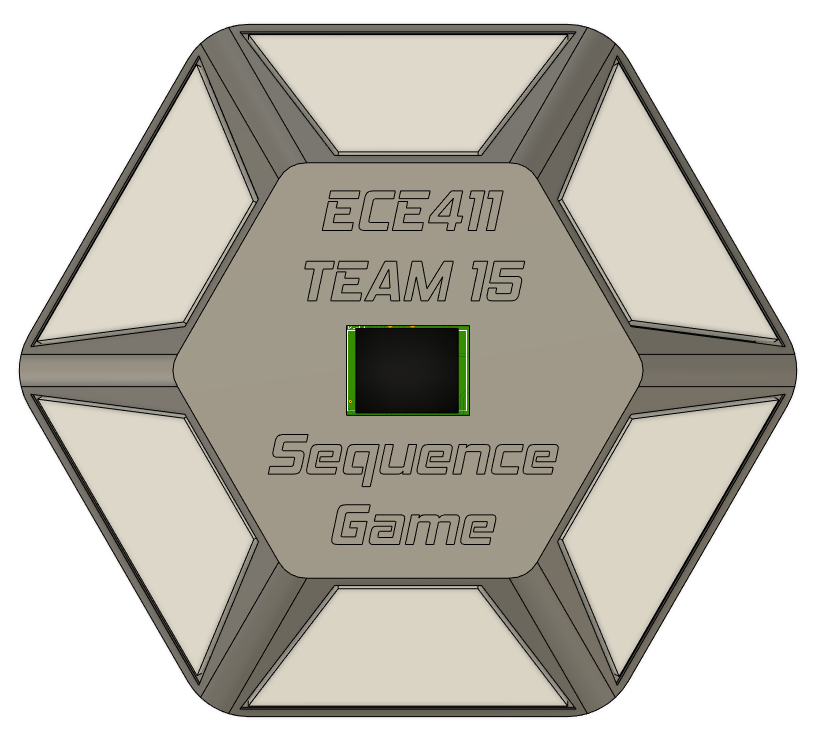

# ECE411 Team 15 Practicum Project

## Links To Documentation:

### [Project_Design_Specification.pdf](docs/Project_Design_Specification.pdf)

### [Practicum_Project_Ideas.pdf](docs/Practicum_Project_Ideas.pdf)

### [Functional_Decomposition.pdf](docs/Functional_Decomposition.pdf)

### [Modeling.pdf](docs/Modeling.pdf)

### [Test_Plan.pdf](docs/Test_Plan.pdf)

## Final Designs:

### Demo

### Schematic rev 1.1

### PCB Layout rev 1.0

### Physical Design

## Preliminary Designs:

### Breadboard

### Physical Design

