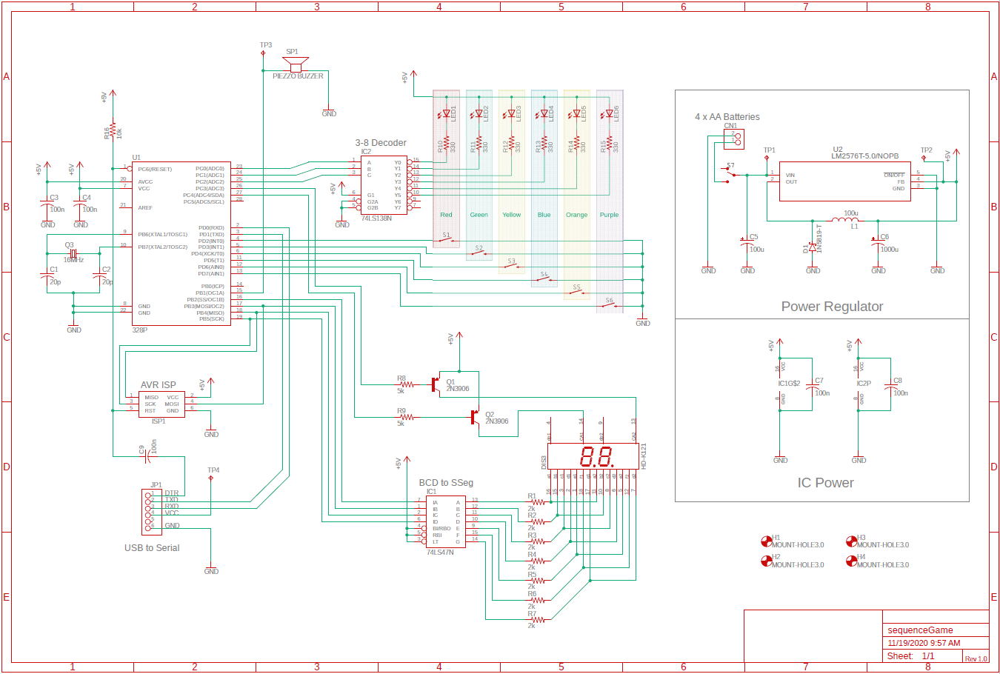
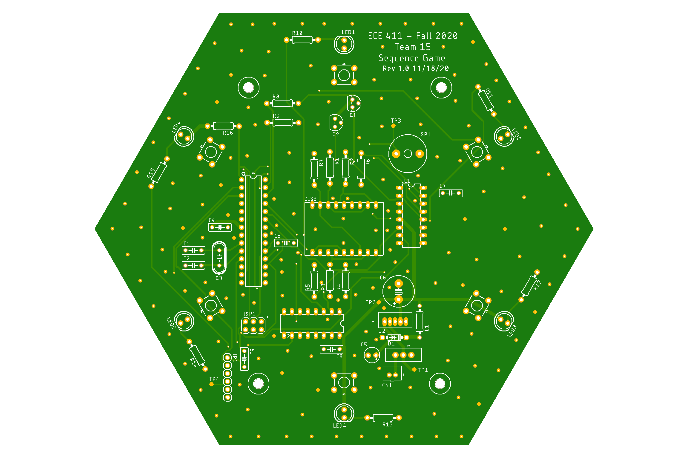
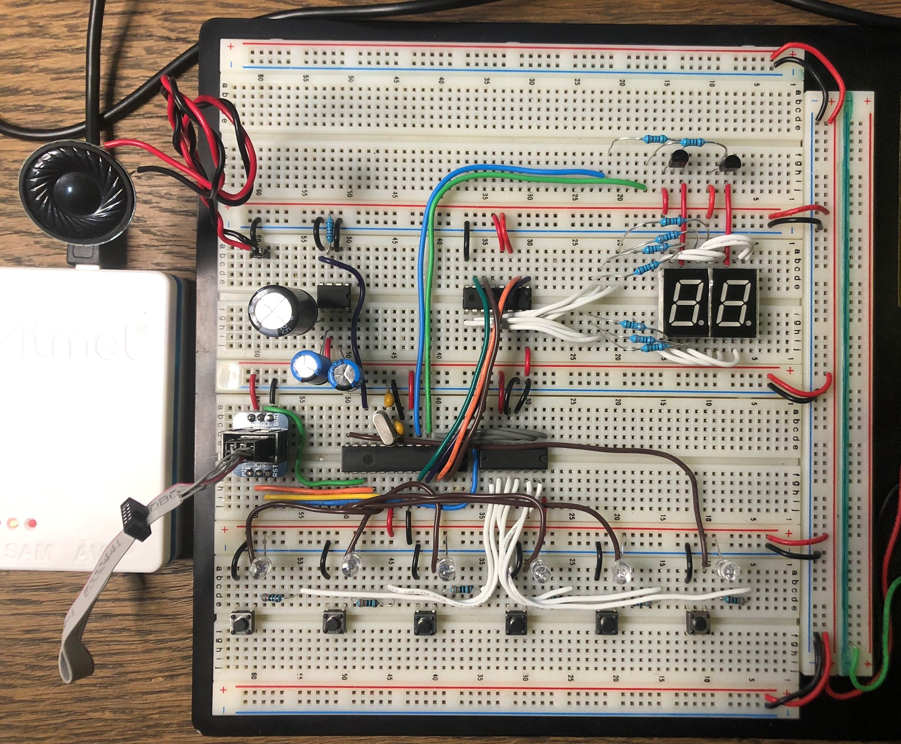
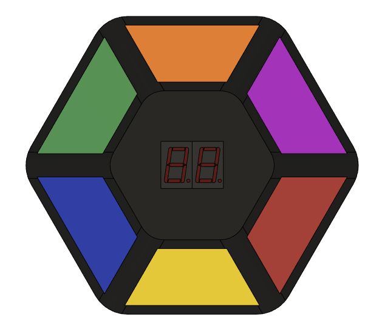
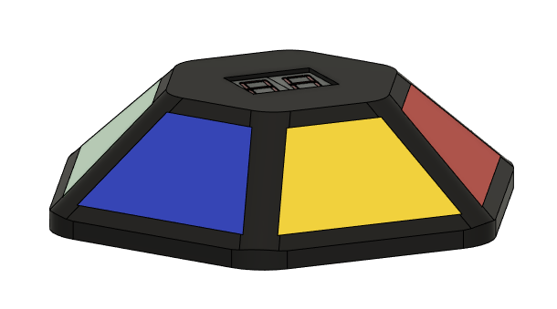

# ECE411 Team 15 Practicum Project

## Links To Documentation:

### [Project_Design_Specification.pdf](docs/Project_Design_Specification.pdf)

### [Practicum_Project_Ideas.pdf](docs/Practicum_Project_Ideas.pdf)

### [Functional_Decomposition.pdf](docs/Functional_Decomposition.pdf)

## Preliminary Designs:

### Schematic rev 1.0

### PCB Layout rev 1.0

### Breadboard

### Physical Design

